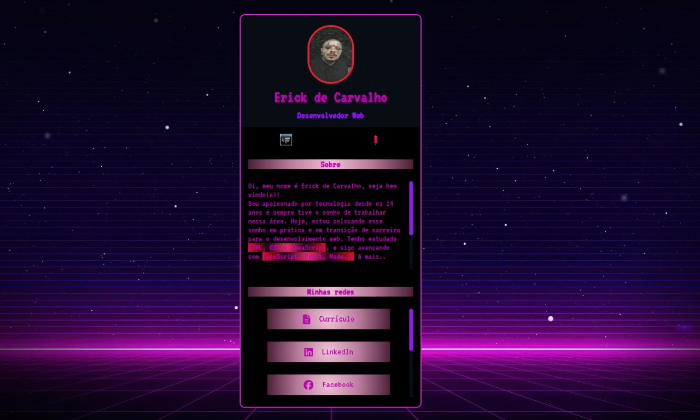

# 🚀 Mini Portfólio - Erick de Carvalho

Projeto pessoal criado com **HTML**, **CSS** e **JavaScript** para apresentar meu mini portfólio como Desenvolvedor Web.

## - LINK: https://erickao-120hzz.github.io/mini-portfolio/

---

## Tecnologias Utilizadas

| Tecnologia | Nível                                                     |
| ---------- | --------------------------------------------------------- |
| HTML       |  |
| CSS        |          |
| JavaScript |         |

---

## Sobre o Projeto

Este projeto foi feito para praticar meus conhecimentos e criar uma apresentação pessoal online. Ele conta com:

- Informações sobre mim e meus hobbies
- Links para minhas redes sociais
- Visual responsivo e animado

---

## 📸 Preview

---

## Minhas redes sociais

| Plataforma | Link                                                                                              |
| ---------- | ------------------------------------------------------------------------------------------------- |
| LinkedIn   | [linkedin.com/in/erick-carvalho-394860243](https://www.linkedin.com/in/erick-carvalho-394860243/) |
| GitHub     | [github.com/erickao-120hzz](https://github.com/erickao-120hzz)                                    |
| Instagram  | [instagram.com/erickzdv](https://www.instagram.com/erickzdv)                                      |
| Facebook   | [facebook.com/ErickCarvalho26](https://www.facebook.com/ErickCarvalho26)                          |
| Discord    | [discord.com/invite/YfDZbKJVt5](https://discord.com/invite/YfDZbKJVt5)                            |

---

📧 Para sugestões ou contribuições: erickcarvalho661@hotmail.com

---

🧠 Em constante aprendizado e evolução. Em breve:

- TypeScript
- React
- Node.js
- SQL
