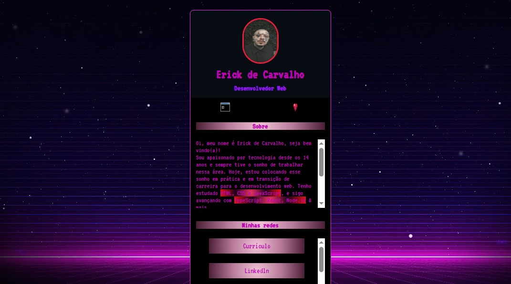

# Mini Portfólio - Erick de Carvalho

🚀 Projeto pessoal criado com HTML, CSS e JavaScript para apresentar meu portfólio como Desenvolvedor Web.

🔗 **Acesse o projeto online:**  
👉 [Clique aqui para ver o portfólio](https://erickao-120hzz.github.io/mini-portfolio/)

## ✨ Tecnologias utilizadas

- HTML
- CSS
- JavaScript

## 💻 Sobre o projeto

Este projeto foi feito com o objetivo de praticar meus conhecimentos em desenvolvimento web e criar uma mini apresentação pessoal online. Ele conta com:

- Informações sobre mim e meus hobbies
- Links para minhas redes sociais
- Visual responsivo e animado

## 📸 Preview

## 📱 Minhas redes

- [LinkedIn](https://www.linkedin.com/in/erick-carvalho-394860243/)
- [GitHub](https://github.com/erickao-120hzz)
- [Instagram](https://www.instagram.com/erickzdv)
- [Facebook](https://www.facebook.com/ErickCarvalho26)
- [Discord](https://discord.com/invite/YfDZbKJVt5)

---

🧠 Em constante aprendizado e evolução. Em breve, novas versões com:

- TypeScript
- React
- Node.js
- SQL

